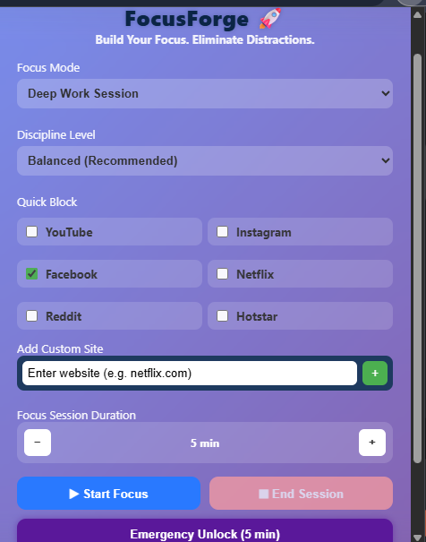
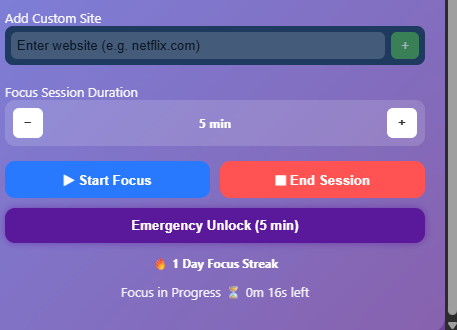
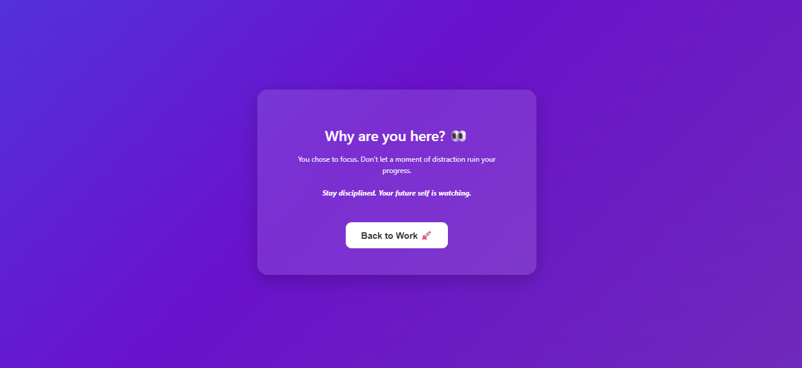
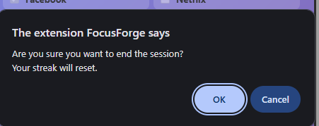
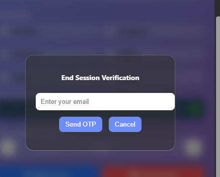

# 🔥 FocusForge

A smart productivity Chrome extension designed to help users eliminate distractions and build discipline by blocking distracting websites during focused work sessions.

Unlike traditional website blockers, FocusForge adds **behavioral discipline mechanisms** like OTP verification, discipline levels, emergency unlock cooldowns, and streak tracking to prevent impulsive bypassing.

---

## 🚀 Features

- Block distracting websites during active focus sessions
- **Deep Work Mode** — set a custom focus duration and stay distraction-free until the session ends
- **Daily Limit Mode** — set a daily time cap for distracting websites
- **Discipline Level System** — choose your level of strictness:
  - **Balanced Mode** → allows emergency unlock
  - **Strict Mode** → disables emergency unlock completely
- **Quick Block Presets** — instantly block common distracting platforms:
  - YouTube
  - Instagram
  - Facebook
  - Netflix
  - Reddit
  - Hotstar
- **Custom Site Blocking** — manually add any distracting website
- **Adjustable Focus Timer** — customize session duration using increment/decrement controls
- **OTP-Based Verification** — secure email verification before ending sessions
- **Emergency Unlock (5 mins)** — temporary unlock option for urgent needs (Balanced mode only)
- **Emergency Unlock Cooldown** — after use, emergency unlock stays disabled for 2 hours
- **Motivational Blocked Page** — users are redirected to a motivational interruption page when opening blocked sites
- **Focus Streak Tracking** — track consistency and maintain productivity streaks
- **Live Session Status** — shows current focus session progress
- **Real-Time Countdown Timer** — tracks remaining session time dynamically
- **Manual Session Control** — users can manually end sessions (OTP required)
- Persistent blocking using background service worker

---

## 🛠️ Tech Stack

### Frontend
- Chrome Extension (Manifest V3)
- HTML
- CSS
- JavaScript

### Backend
- Node.js
- Express.js

### Email Service
- Nodemailer (Gmail SMTP)

---

## 🏗️ System Architecture

```text
User (Chrome Browser)
        |
        v
 Chrome Extension (Manifest V3)
        |
   _____|______
  |            |
popup.js   background.js
  |            |
  |     content.js
  |            |
  |     Blocked? → blocked.html
  |
  | (OTP Request)
  v
Node.js + Express Backend
        |
        v
 Nodemailer (Gmail SMTP)
        |
        v
 User Email (OTP Delivered)
```

---

## 🔄 Workflow

### Focus Session Flow

1. User selects focus mode (Deep Work / Daily Limit)
2. User chooses discipline level (Balanced / Strict)
3. User selects websites from quick block presets
4. User can add custom websites manually
5. User sets focus session duration
6. User starts focus session
7. Extension stores session data in Chrome storage
8. Every website visit is checked against blocklist
9. If blocked:
   - Redirect to motivational blocked page
10. User can:
   - Return back to work
   - Use Emergency Unlock (Balanced mode only)
   - End session using OTP verification

---

## 🧠 Discipline Logic

### Balanced Mode
- Emergency unlock enabled
- Temporary unlock for 5 minutes
- After use → disabled for next 2 hours

### Strict Mode
- Emergency unlock disabled
- OTP verification required to end session

This ensures stronger self-discipline and reduces impulsive distraction.

---

## 📁 Project Structure

```text
focus-forge/
├── backend/
│   ├── server.js
│   ├── package.json
│   └── .env
│
├── extension/
│   ├── manifest.json
│   ├── popup.html
│   ├── popup.js
│   ├── background.js
│   ├── content.js
│   ├── blocked.html
│   ├── blocked.js
│   ├── blocked.css
│   └── style.css
│
├── screenshots/
│   ├── dashboard.png
│   ├── focus-controls.png
│   ├── blocked-page.png
│   ├── end-session-confirmation.png
│   └── otp-modal.png
│
└── .gitignore
```

---

## ⚙️ Setup

### Backend Setup

```bash
cd backend
npm install
node server.js
```

---

### Extension Setup

1. Open Chrome  
2. Go to:

```text
chrome://extensions
```

3. Enable Developer Mode  
4. Click **Load Unpacked**
5. Select the extension folder

---

## 🔐 Environment Variables

Create a `.env` file inside `/backend`

```env
EMAIL_USER=your_email@gmail.com
EMAIL_PASS=your_app_password
```

---

## 🧪 Testing

| Test Case | Expected Result |
|----------|----------------|
| Add site to blocklist | Site gets blocked |
| Select quick block presets | Sites added instantly |
| Add custom site | Site added to blocklist |
| Start focus session | Timer starts and blocking begins |
| Visit blocked site | Redirected to blocked page |
| Click Back to Work | Returns user to workflow |
| Balanced mode emergency unlock | Temporary unlock granted |
| Strict mode emergency unlock | Unlock disabled |
| Emergency unlock cooldown | Disabled for 2 hours after use |
| Request OTP | OTP sent via email |
| Enter correct OTP | Session ends successfully |
| Enter wrong OTP | Error displayed |
| End session manually | OTP verification required |
| Focus streak tracking | Streak updates correctly |
| Countdown timer | Remaining time updates live |

---

## 📸 Screenshots

### Main Dashboard

Configure focus mode, discipline level, and select distracting websites.



---

### Focus Controls & Streak Tracking

Manage timer, emergency unlock, and monitor focus streak.



---

### Blocked Website Redirect

Motivational interruption page shown during blocked access.



---

### End Session Confirmation

Prevents accidental or impulsive session termination.



---

### OTP Verification Modal

Secure email verification for ending focus sessions.



---

## 🔮 Future Improvements

- Productivity analytics dashboard
- Weekly focus reports via email
- Cloud sync across devices
- AI-based distraction detection
- Custom motivational messages
- Cross-browser support
- Focus history tracking

---

## 👩‍💻 Developer

**dev-trisha**  
GitHub: https://github.com/dev-trisha
